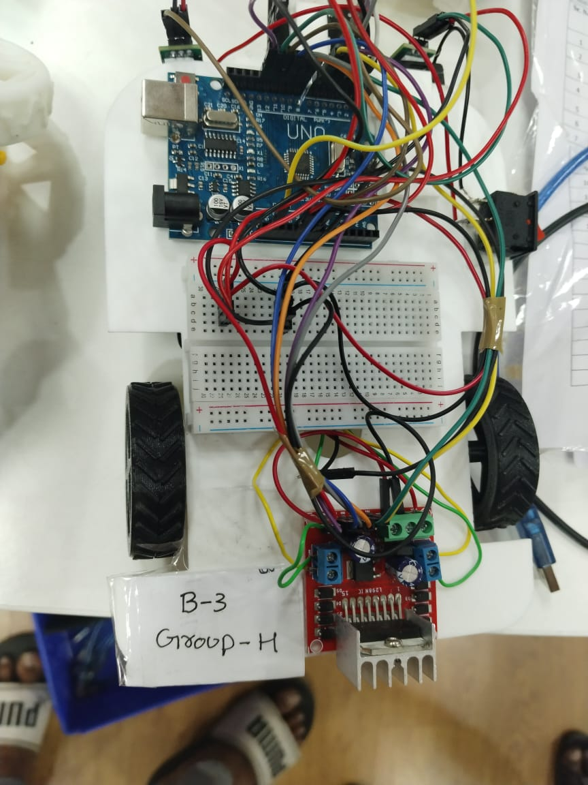
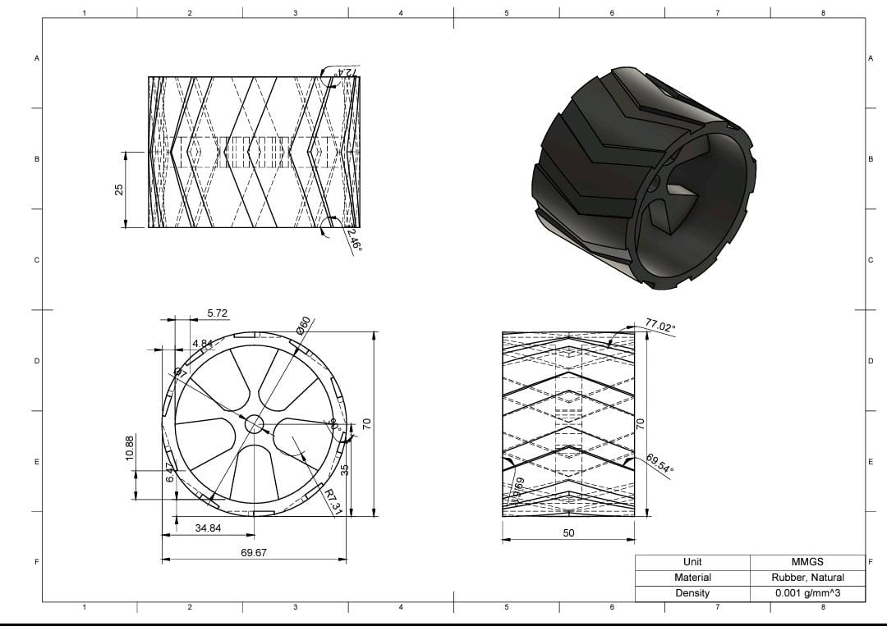

# Color-Sensing Line Follower Robot

This project showcases a **color-sensing line follower robot**, designed using Arduino and basic electronics. While it functions as a standard line follower, we implemented a unique **bus-stop-like system using color sensing**, where different track colors trigger specific actions.

---

## 🔧 Features

- **Standard Line Following** using IR sensors.
- **Motor Control** via L298N motor driver.
- **Custom-built** with 3D printed wheels and a laser-cut chassis.
- **Color-Based Behavior Modulation** using TCS3200 color sensor:
  - Stop when a specific color is detected.
  - Future scope includes handling other colors for actions like **slowdown**, **pause**, and more.

---

## Concept Overview

The robot simulates a **bus transit system**:

- A colored section in the track near a "bus stop" serves as a **trigger zone**.
- The color in that zone can be changed dynamically to signal the robot.
- For example, during the demo, a specific color was used to make the robot **halt** at a stop.
  
This idea could be extended into smart transport simulation or warehouse systems where **track color communicates behavior** to bots.

---

## Components Used

| Component              | Description                         |
|------------------------|-------------------------------------|
| Arduino Uno            | Main microcontroller board          |
| IR Sensors (x2)        | For line detection                  |
| TCS3200 Color Sensor   | For detecting track color           |
| L298N Motor Driver     | Dual H-bridge for motor control     |
| Custom Wheels          | 3D printed for precision and grip   |
| Chassis                | Laser-cut acrylic structure         |
| DC Motors (x2)         | For driving the robot               |
| Power Supply           | Battery pack or USB power           |

---

## Engineering Design

---

## Getting Started

1. Upload the Arduino code (`code/color_line_follower.ino`) to the Uno board.
2. Place the robot on a **black line on a white surface**.
3. Use the TCS3200 to detect color patches along the line.
4. When the specified color is detected, the robot stops.

---

## Future Improvements

- Expand color-command mappings (e.g., blue = slow, red = stop).
- Implement timed pauses or directional decisions.
- Wireless control for dynamic track color changes.
- Real-world miniature **smart bus simulation** with multiple stops.

---

## Team memebrs

- Tejas Bhavekar – Hardware integration, color logic
- Suryash Nagar - Hardware integration
- Sumit Sarkar - Design
- Taneti Naveen - Design
- Tushar Saxena - Colour logic
- Suryansh Garg - Design
